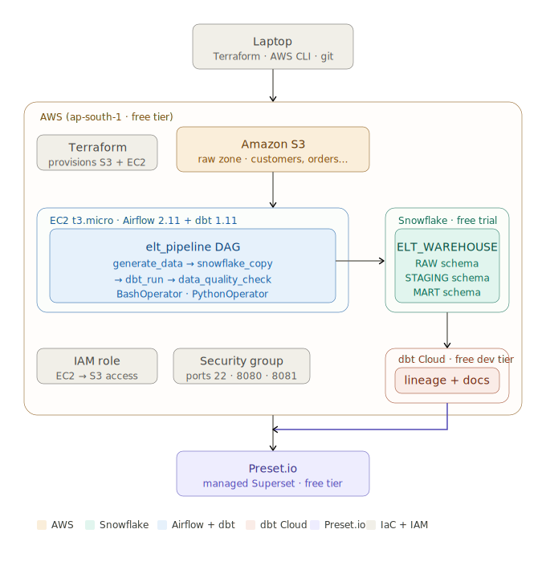
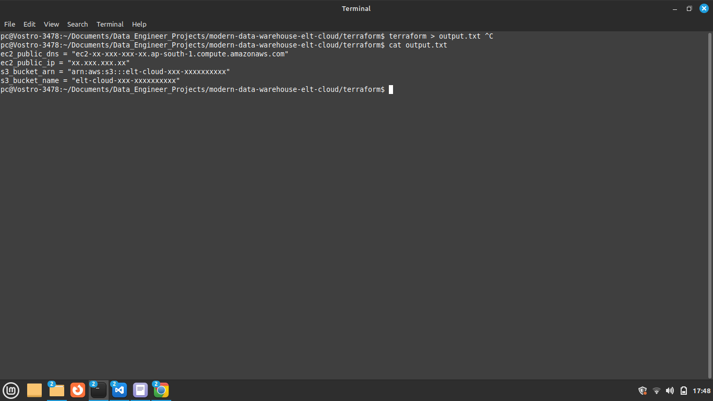
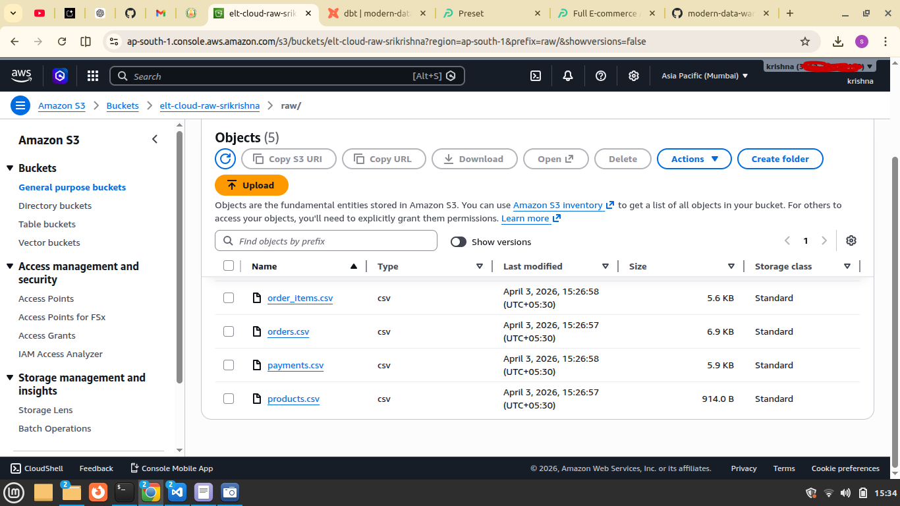
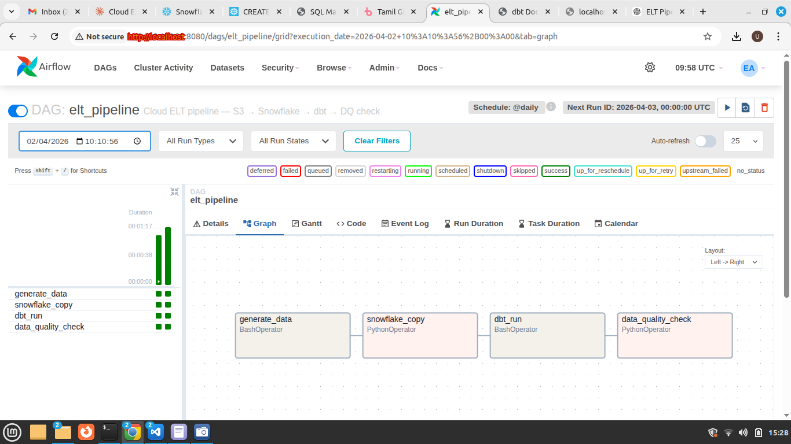
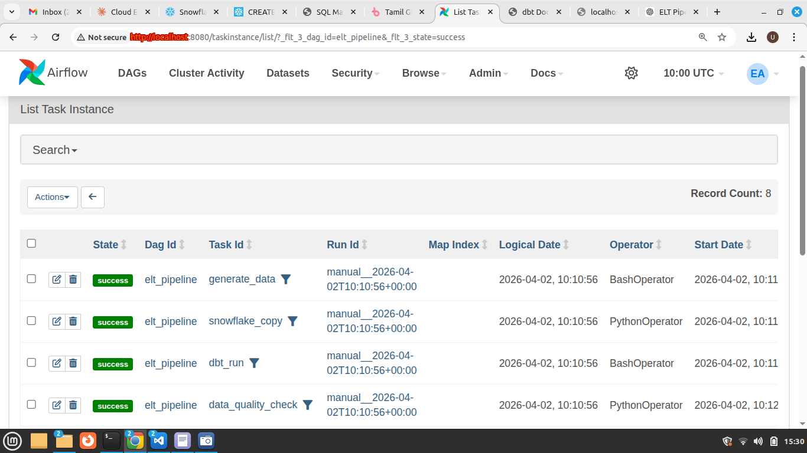
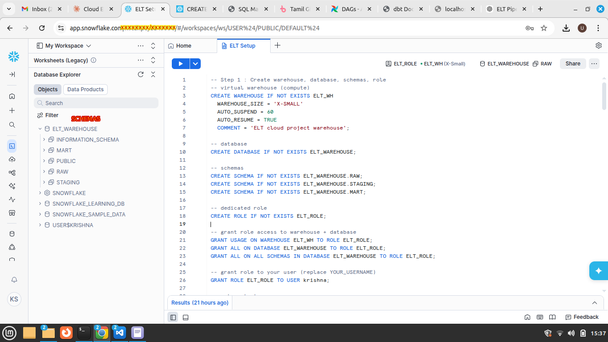
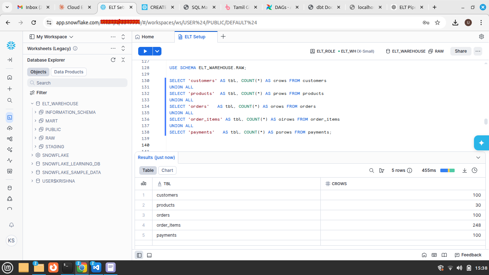
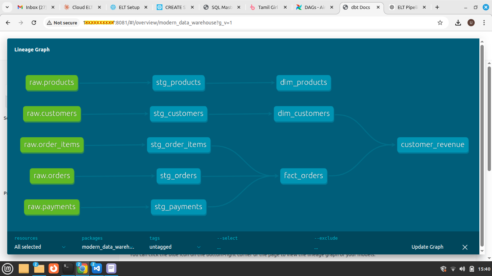
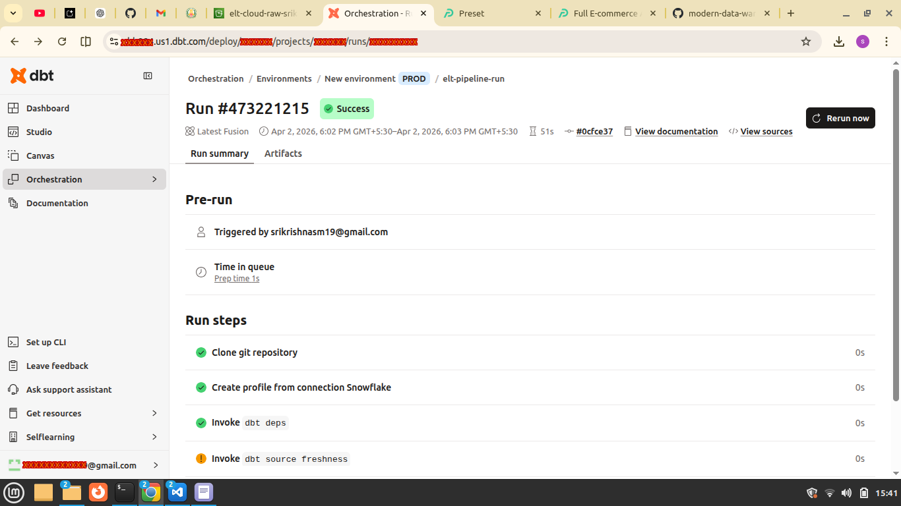
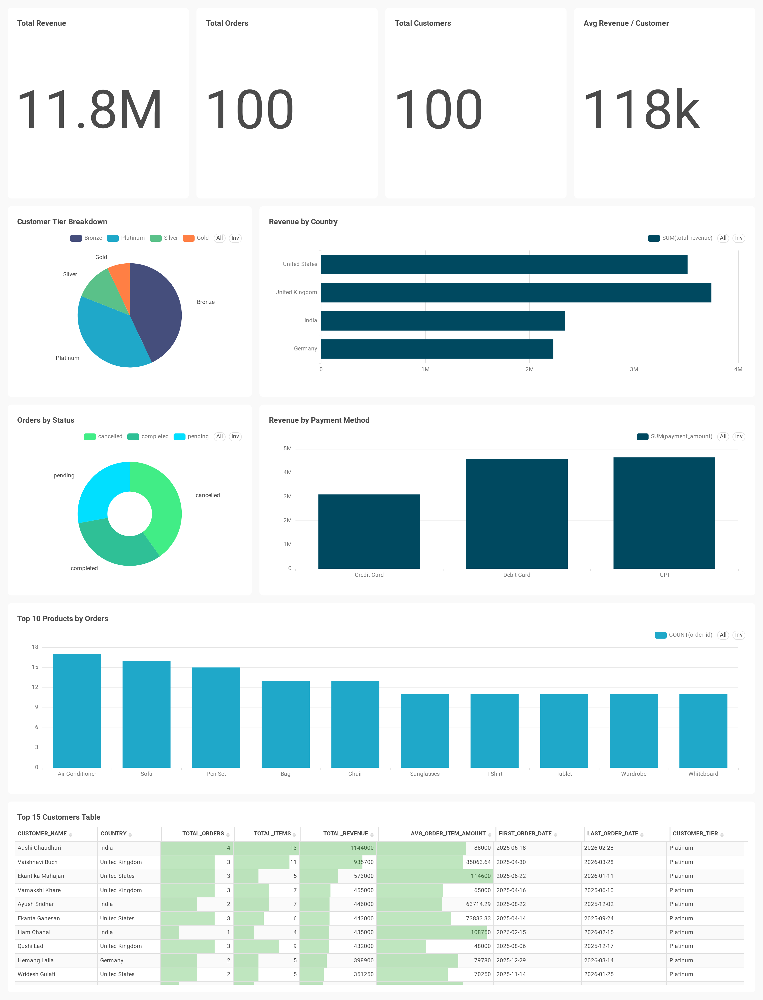

# Modern Data Warehouse — Cloud ELT Pipeline

> Cloud-native ELT pipeline built on AWS S3, Snowflake, dbt, Apache Airflow, and Preset.io.  
> Companion to the [local version](https://github.com/srikrishnasm/modern-data-warehouse-elt) built with Docker + PostgreSQL.

---

## Architecture



---

## Pipeline overview

```
Python + Faker (CSV generation)
       ↓ boto3
Amazon S3 (raw zone)
       ↓ Airflow DAG (EC2 t3.micro)
Snowflake COPY INTO (raw schema)
       ↓ dbt (EC2)
Snowflake staging + mart schemas
       ↓
Preset.io dashboard
```

This project implements a cloud-native ELT (Extract, Load, Transform) pipeline for a synthetic e-commerce dataset. The pipeline is fully orchestrated by Apache Airflow running on AWS EC2 and runs on a daily schedule.

Extract — synthetic e-commerce data (customers, orders, products, payments) is generated using Python's Faker library and extracted as CSV files, then uploaded directly to Amazon S3 raw zone using boto3.

Load — Apache Airflow triggers a Snowflake COPY INTO command that loads the raw CSV files from S3 into the Snowflake raw schema. This replaces the previous day's data with a full refresh on every run.

Transform — dbt runs directly on EC2 and connects to Snowflake to execute two layers of transformation. The staging layer cleans and types the raw data into views. The mart layer builds dimension tables (dim_customers, dim_products), an incremental fact table (fact_orders), and a revenue aggregation table (customer_revenue) with customer tier segmentation.

Visualize — Preset.io (managed Apache Superset) connects to the Snowflake mart schema and serves an interactive e-commerce analytics dashboard showing revenue by country, customer tier breakdown, orders by status, top customers, and sales by product category.

The entire stack runs on free tier services — AWS S3, EC2 t3.micro, Snowflake trial credits, dbt Cloud developer tier, and Preset.io free tier — making it fully reproducible at zero cost.

## Tech stack

| Layer | Tool | Purpose |
|---|---|---|
| Infrastructure | Terraform | Provision S3 bucket + EC2 instance |
| Storage | Amazon S3 | Raw CSV landing zone |
| Orchestration | Apache Airflow 2.11.0 on EC2 | Pipeline scheduling and monitoring |
| Data generation | Python + Faker | Synthetic e-commerce data |
| Ingestion | Snowflake COPY INTO | Load CSV from S3 → raw schema |
| Warehouse | Snowflake | Raw, staging, and mart schemas |
| Transformation | dbt 1.11.7 on EC2 | Staging views + mart tables |
| Documentation | dbt Cloud (free tier) | Lineage graph + model docs |
| Visualization | Preset.io (free tier) | Interactive e-commerce dashboard |

---

## Screenshots

### Terraform output
> AWS resources provisioned via Terraform — S3 bucket + EC2 instance



---

### S3 bucket — raw zone
> CSV files uploaded by data generator via boto3



---

### Airflow DAG
> Four-task pipeline DAG running on EC2 t3.micro



---

### Airflow successful run
> End-to-end pipeline run — all tasks green



---

### Snowflake schemas
> Three-layer warehouse — RAW · STAGING · MART



---

### Snowflake row counts
> Data verified across all layers after pipeline run



---

### dbt lineage graph
> Full model lineage from raw sources to mart tables



---

### dbt job run
> Successful dbt Cloud job run with all models passing



---

### Preset dashboard
> E-commerce analytics dashboard built on Snowflake mart tables



---

## Airflow DAG

```
generate_data → snowflake_copy → dbt_run → data_quality_check
```

| Task | Operator | Description |
|---|---|---|
| `generate_data` | BashOperator | Faker generates CSV → uploads to S3 via boto3 |
| `snowflake_copy` | PythonOperator | COPY INTO raw schema tables from S3 stage |
| `dbt_run` | BashOperator | dbt run + dbt test on EC2 |
| `data_quality_check` | PythonOperator | Validate row counts across all layers |

---

## dbt lineage

```
raw.customers ──────────────────► stg_customers ──► dim_customers ──► customer_revenue
raw.orders ─────────────────────► stg_orders ─────┐
raw.order_items ────────────────► stg_order_items ─┼─► fact_orders ──► customer_revenue
raw.payments ───────────────────► stg_payments ────┘
raw.products ───────────────────► stg_products ───► dim_products ───► fact_orders
```

---

## dbt models

| Model | Schema | Type | Description |
|---|---|---|---|
| `stg_customers` | staging | view | Cleaned customer records |
| `stg_orders` | staging | view | Cleaned order records |
| `stg_order_items` | staging | view | Cleaned order line items |
| `stg_payments` | staging | view | Cleaned payment records |
| `stg_products` | staging | view | Cleaned product catalog |
| `dim_customers` | mart | table | Customer dimension |
| `dim_products` | mart | table | Product dimension |
| `fact_orders` | mart | incremental | Order fact table |
| `customer_revenue` | mart | table | Revenue aggregation per customer |

---

## Project structure

```
modern-data-warehouse-elt-cloud/
├── terraform/                  # IaC — S3 bucket + EC2 instance
│   ├── main.tf
│   ├── variables.tf
│   └── outputs.tf
├── airflow/
│   ├── dags/
│   │   └── elt_pipeline.py     # Airflow DAG
│   └── scripts/
│       └── data_generator.py   # Faker + boto3 S3 upload
├── dbt_project/                # dbt models
│   ├── models/
│   │   ├── staging/            # 5 staging views
│   │   └── marts/              # dim + fact + revenue tables
│   └── macros/                 # custom dbt tests
├── scripts/
│   └── setup_snowflake.sql     # one-time Snowflake setup
├── docs/                       # architecture + screenshots
└── config/
    └── .env.example            # credentials template
```

---

## Data model

- 100 customers across 4 countries (India, US, UK, Germany)
- 30 products across 6 categories (Electronics, Fashion, Accessories, Furniture, Stationery, Home Appliances)
- Orders with status: completed / pending / cancelled
- Payments via UPI, Credit Card, Debit Card

### Customer tier segmentation

| Tier | Total revenue |
|---|---|
| Platinum | ≥ ₹1,00,000 |
| Gold | ≥ ₹50,000 |
| Silver | ≥ ₹10,000 |
| Bronze | < ₹10,000 |

---

## Quick start

### Prerequisites

- AWS account (free tier)
- Snowflake account (free trial)
- Terraform CLI installed
- AWS CLI configured

### 1. Clone and configure

```bash
git clone https://github.com/srikrishnasm/modern-data-warehouse-elt-cloud.git
cd modern-data-warehouse-elt-cloud
cp config/.env.example config/.env
# fill in your AWS + Snowflake credentials in config/.env
```

### 2. Provision AWS resources

```bash
cd terraform
terraform init
terraform apply
# note the EC2 IP and S3 bucket name from output
```

### 3. Setup Snowflake

```bash
# run scripts/setup_snowflake.sql in Snowflake UI
# creates: warehouse, database, schemas, stage
```

### 4. Generate data and upload to S3

```bash
python3 airflow/scripts/data_generator.py
```

### 5. SSH into EC2 and trigger pipeline

```bash
ssh -i ~/.ssh/elt-cloud-key.pem ubuntu@YOUR_EC2_IP
airflow dags trigger elt_pipeline
```

### 6. View results

| Service | URL |
|---|---|
| Airflow | http://YOUR_EC2_IP:8080 |
| Snowflake | https://app.snowflake.com |
| dbt Cloud | https://cloud.getdbt.com  |
| dbt Docs  | http://<ec2-server-ip>:8081 |
| Preset    | https://preset.io |

---

## Cost — 100% free

| Service | Plan | Cost |
|---|---|---|
| Amazon S3 | Free tier (5GB) | $0 |
| EC2 t3.micro | Free tier (750 hrs/month) | $0 |
| Snowflake | Free trial ($400 credits) | $0 |
| dbt Cloud | Developer free tier | $0 |
| Preset.io | Free tier | $0 |
| **Total** | | **$0** |

---

## Stop resources (save credits)

```bash
# stop EC2 when not in use
aws ec2 stop-instances --instance-ids YOUR_INSTANCE_ID

# suspend Snowflake virtual warehouse
# Snowflake UI → Admin → Warehouses → ELT_WH → Suspend

# destroy all AWS resources (full reset)
cd terraform && terraform destroy
```

---

## Related project

[Local version](https://github.com/srikrishnasm/modern-data-warehouse-elt) — same pipeline built locally with Docker, PostgreSQL, and Apache Superset. No cloud account needed.

---

## Author

**Srikrishna** — Data Engineer  
[GitHub](https://github.com/srikrishnasm)